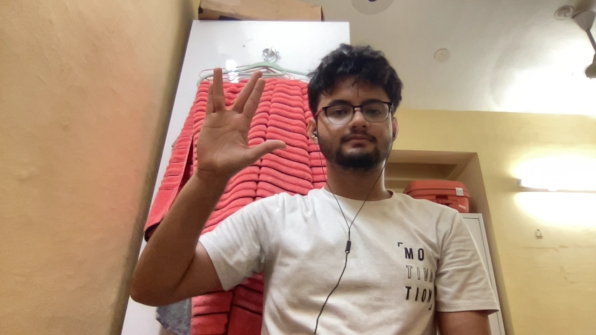
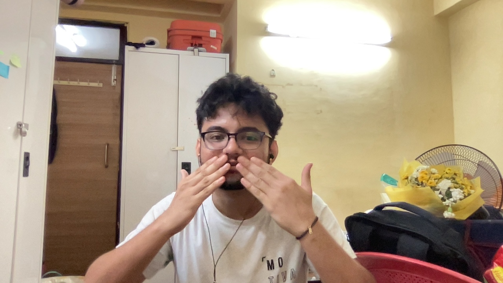
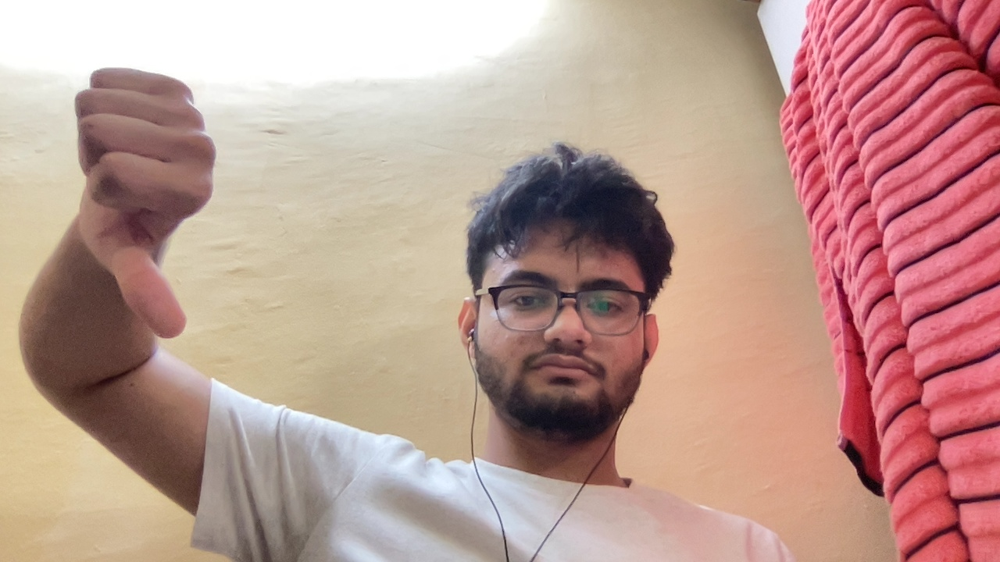
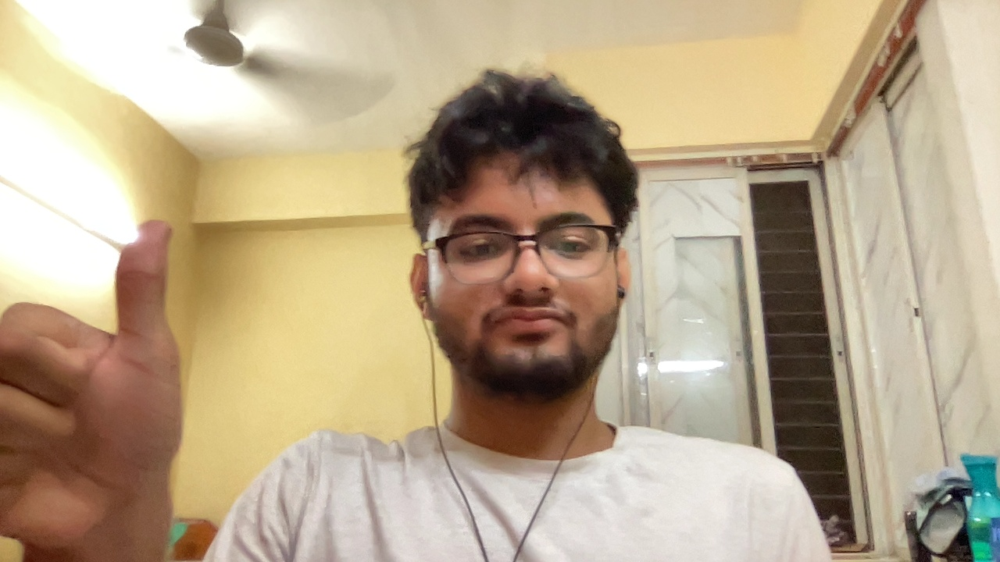

# Hear-Me-Out
This directory contains a project made by me in the summer of 2022. The brief overview is that it is a sign-language detector based on YOLO model.

## Introduction
In this project I have made a Real Time Sign Language Detector called "Hear Me Out" using YOLOv5 model. In the covid era, video calls and online meets had become the new normal and at such times I thought what about the people who can't talk. I know the immediate thought in your head, "chat bruh". But here is the thing, when we attend a school / college lecture the teacher usually ain't looking at the chat so in this instance what about students who can't speak ask their doubts in class? Similarly one can also find various other instances such as office meets, society talks etc. We very well know that the knowledge about sign language is sparse among people, so if one can build a program that can on basis of image/video inputs output the corresponding meaning/message of that symbol. It would be fantastic, right? So in this project I have tried to build a very basic prototype of that model by using 4 different symbols of sign language.

## Model and Libraries
For this project I used **YOLOv5** model and fine-tuned the pre-existing trained model for my dataset. I used TensorFlow to write out my code and used libraries like matplotlib, scipy, numpy etc to assist me in my model's making, training and testing.

## Generating the Dataset
As I was new to Computer Vision or ML in general, I wanted to experiment a bit by using my own dataset and see what effects would variations in my collected dataset have on the model's performance.
I used **OpenCV** to collect my dataset using my laptop's webcam and labelled them using **labelImg**. My dataset has images from the following 4 different classes:
- thankyou
- thumbsup
- thumbsdown
- livelong

Few of the images from my dataset are :
<table>
  <tr>
    <td align="center"></td>
    <td align="center"></td>
  </tr>
  <tr>
    <td align="center">Live Long Sign</td>
    <td align="center">Thank You Sign</td>
  </tr>
  <tr>
    <td align="center"></td>
    <td align="center"></td>
  </tr>
  <tr>
    <td align="center">Thumbs Down Sign</td>
    <td align="center">Thumbs Up Sign</td>
  </tr>
</table>

## Results
After collecting a small bunch of images from all the classes I trained my model and then tested it for both real-time video and also on the collected test cases. 
Few images showing my model prediction are as following:
<table>
  <tr>
    <td align="center"></td>
    <td align="center"></td>
  </tr>
  <tr>
    <td align="center">Prediction of Live Long Sign</td>
    <td align="center">Prediction of Thank You Sign</td>
  </tr>
  <tr>
    <td align="center"></td>
    <td align="center"></td>
  </tr>
  <tr>
    <td align="center">Prediction of Thumbs Down Sign</td>
    <td align="center">Prediction of Thumbs Up Sign</td>
  </tr>
</table>

## Learnings
In the initial stages of one's learning of Computer Vision, one studies/hears a lot that it's important to have a complex dataset or in simpler terms data having varied background, illumination, relative size etc. I too got to know the same and hence I wanted to see how bad a model will perform given a not so good dataset. So before producing the above results, I also experiented by giving images only having white background (my hostel room's walls :)) and saw how badly my model performs for data not having white background. I also saw stark improvement in my model's performance when I changed my dataset to contain images having different background, lighting etc.

The main purpose of this project was to learn how one makes a project in computer vision and also at the same time make something which is worthwhile and can have great impact in real life.

## Resources
This project closely follows a YouTube tutorial by Nicholas Renotte as it was his video that inspired me to create my own project having my very own custom generated dataset.
